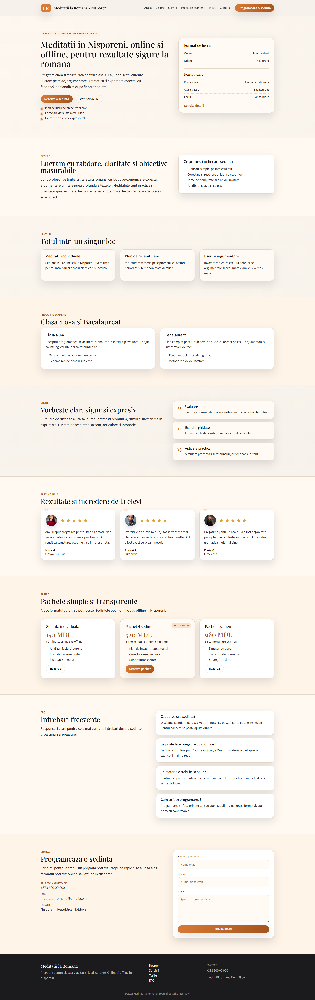

# Meditații la Română — Landing Page

A professional landing page for a Romanian language and literature tutor, offering structured private lessons to help students improve grammar, writing, speaking, and achieve strong results at national exams (clasa a 9-a, Bacalaureat). Lessons are available both online (Zoom / Google Meet) and in person in Nisporeni.

**Live site:** [meditatii-romana.vercel.app](https://meditatii-romana.vercel.app/)  
**Repository:** [github.com/MadalinaDev/tum-web-lab2](https://github.com/MadalinaDev/tum-web-lab2)

---

## Table of Contents

- [Use Case](#use-case)
- [Core Functionalities](#core-functionalities)
- [Page Sections & Flow](#page-sections--flow)
- [Tech Stack](#tech-stack)
- [Project Structure](#project-structure)
- [Getting Started](#getting-started)
- [Environment Variables](#environment-variables)
- [Content Management (CMS)](#content-management-cms)
- [Deployment](#deployment)
- [Screenshots](#screenshots)

---

## Use Case

Parents and students looking for a Romanian language tutor land on this page to learn about the services offered, browse lesson packages, read testimonials from past students, and submit a contact request — all in one scrollable single-page experience. The tutor receives every enquiry instantly as a formatted message in a private Telegram chat.

---

## Core Functionalities

| Feature                    | Description                                                                                           |
| -------------------------- | ----------------------------------------------------------------------------------------------------- |
| Multi-section landing page | Nine content sections covering the full user journey from discovery to conversion                     |
| Bilingual UI (RO / RU)     | Full client-side i18n — every text string switches between Romanian and Russian without a page reload |
| Dark / Light theme         | System-aware theme with a manual toggle persisted across visits via `next-themes`                     |
| Pricing packages           | Configurable plans with draft/publish state and optional discount badges                              |
| Contact form → Telegram    | Validated form that POSTs to a Next.js API route which forwards the lead to a Telegram bot            |
| Confetti on submit         | `canvas-confetti` fires a branded colour burst when the form is successfully submitted                |
| Scroll-reveal animations   | `IntersectionObserver` adds an `in-view` class to each section as it enters the viewport              |
| Friendly mascot            | A persistent floating mascot character with a speech bubble sits above the contact form               |
| Decap CMS                  | Git-based headless CMS at `/admin` for non-technical content editing via the GitHub backend           |
| Responsive design          | Mobile-first layout with a hamburger nav, fluid typography, and a sticky header                       |

---

## Page Sections & Flow

The page is a single scrollable document. Sections are rendered in the following order:

### 1. Header (sticky)

A translucent, blur-backed sticky bar containing the site logo/mascot, anchor navigation links, a language toggle (RO ↔ RU), and a dark/light theme toggle. On mobile it collapses into a hamburger menu.

### 2. Hero

The above-the-fold introduction. It presents the tutor's core value proposition, two call-to-action buttons (_Book a lesson_ and _See services_), a bullet list of key highlights, and an info card showing lesson formats (online/offline) and target student profiles. This is the primary conversion entry point.

### 3. Despre (About)

A two-column section introducing the tutor's background and pedagogical approach. A companion card lists the tutor's key competencies and qualifications. Establishes trust before the visitor explores services.

### 4. Servicii (Services)

Three cards describing the main service types: individual tutoring, structured revision plans, and essay/argumentation coaching. Each card has a heading and short description so visitors can quickly identify what fits their needs.

### 5. Pregătire (Preparation Programs)

A 2×2 grid of program cards (e.g., exam prep for clasa a 9-a, Bacalaureat preparation). Each card lists specific features/topics covered, giving prospective students a clear picture of the learning path.

### 6. Dicție (Diction)

Covers oral expression and diction training. A numbered step-by-step list on the right side explains the methodology — making a potentially abstract service concrete and approachable.

### 7. Testimoniale (Testimonials)

Three student review cards, each with a profile photo, star rating, quote, name, and role. The quote mark decorative element and star ratings add social proof and credibility.

### 8. Tarife (Pricing)

Three pricing plan cards rendered from a data source that supports `draft` (hidden) and `published` states. A `recommended` flag highlights the most popular plan with a special badge and border. Plans can show a strikethrough original price alongside a discount badge. Each plan's CTA button fires a `selectPackage` custom event that pre-fills the contact form and smooth-scrolls to it.

### 9. FAQ

An accordion FAQ. Only one question is open at a time. The arrow indicator rotates 180° on open/close via a CSS transition. Questions are fully content-managed.

### 10. Contact

A lead-capture form with fields for name, phone number, lesson package (auto-populated from the pricing CTA or manually selected from a dropdown), and a free-text message. On successful submission the form resets and a confetti animation fires. The backend API route (`/api/contact`) validates input, escapes it for Telegram MarkdownV2, and sends a formatted message to the tutor's Telegram bot. A floating mascot with a speech bubble sits adjacent to the form on desktop.

### 11. Footer

Contains footer navigation links, copyright notice, and a secondary set of the language and theme toggles.

---

## Tech Stack

| Layer         | Technology                                                   |
| ------------- | ------------------------------------------------------------ |
| Framework     | [Next.js 15](https://nextjs.org/) (App Router)               |
| Language      | TypeScript                                                   |
| UI Library    | React 19                                                     |
| Styling       | Tailwind CSS 3 + custom CSS variables                        |
| Theming       | [next-themes](https://github.com/pacocoursey/next-themes)    |
| Animations    | CSS transitions + `IntersectionObserver` (ScrollReveal)      |
| Confetti      | [canvas-confetti](https://github.com/catdad/canvas-confetti) |
| CMS           | [Decap CMS](https://decapcms.org/) (GitHub backend)          |
| Notifications | Telegram Bot API                                             |
| Deployment    | [Vercel](https://vercel.com/)                                |
| Legacy SSG    | 11ty / Eleventy (superseded by Next.js)                      |

---

## Project Structure

```
tum-web-lab2/
├── src/
│   ├── app/
│   │   ├── layout.tsx          # Root layout: ThemeProvider, LanguageProvider, Header, Footer, Mascot
│   │   ├── page.tsx            # Composes all nine page sections in order
│   │   ├── globals.css         # Global styles, CSS custom properties, utility classes
│   │   └── api/
│   │       └── contact/
│   │           └── route.ts    # POST handler — validates input and calls Telegram Bot API
│   ├── components/
│   │   ├── Header.tsx          # Sticky header with nav, language and theme toggles
│   │   ├── Footer.tsx          # Footer with links and toggles
│   │   ├── Mascot.tsx          # Floating mascot image + speech bubble
│   │   ├── ThemeToggle.tsx     # Dark/light mode button
│   │   ├── LanguageToggle.tsx  # RO / RU switch button
│   │   ├── ThemeProvider.tsx   # Wraps next-themes ThemeProvider
│   │   ├── ScrollReveal.tsx    # IntersectionObserver scroll animation trigger
│   │   └── sections/
│   │       ├── Hero.tsx
│   │       ├── Despre.tsx
│   │       ├── Servicii.tsx
│   │       ├── Pregatire.tsx
│   │       ├── Dictie.tsx
│   │       ├── Testimoniale.tsx
│   │       ├── Tarife.tsx
│   │       ├── Faq.tsx
│   │       └── Contact.tsx
│   ├── context/
│   │   └── LanguageContext.tsx # React context: current language, translations object, toggle()
│   ├── i18n/
│   │   └── translations.ts     # Full RO and RU translation objects
│   └── admin/
│       ├── index.html          # Decap CMS SPA entry
│       └── config.yml          # CMS collections: site settings, hero, services, pricing, FAQ, etc.
├── public/
│   └── images/                 # Static assets (mascot, testimonial avatars)
├── next.config.ts
├── tailwind.config.ts
└── package.json
```

---

## Getting Started

### Prerequisites

- Node.js ≥ 18
- npm or yarn

### Install dependencies

```bash
npm install
```

### Run the development server

```bash
npm run dev
```

Open [http://localhost:3000](http://localhost:3000) in your browser.

### Build for production

```bash
npm run build
npm start
```

---

## Environment Variables

Create a `.env.local` file at the project root. The contact form will not work without these values.

```env
TELEGRAM_BOT_TOKEN=<your_telegram_bot_token>
TELEGRAM_CHAT_ID=<your_telegram_chat_id>
```

| Variable             | Description                                                              |
| -------------------- | ------------------------------------------------------------------------ |
| `TELEGRAM_BOT_TOKEN` | Token from [@BotFather](https://t.me/botfather) for the notification bot |
| `TELEGRAM_CHAT_ID`   | Numeric ID of the chat (or group) where leads are delivered              |

---

## Content Management (CMS)

The site uses [Decap CMS](https://decapcms.org/) with the GitHub backend. Editors can log in at `/admin` using their GitHub account (must have write access to the repository).

CMS-managed content includes: site settings, navigation, hero section, services, preparation programs, diction steps, testimonials, pricing packages, FAQ items, and contact info.

Updating content via the CMS opens a pull request (or commits directly to `master` depending on branch configuration) — no code changes required.

---

## Deployment

The project is deployed on **Vercel** with automatic deployments on every push to `master`.

**Live URL:** [https://meditatii-romana.vercel.app/](https://meditatii-romana.vercel.app/)

Make sure to add the `TELEGRAM_BOT_TOKEN` and `TELEGRAM_CHAT_ID` environment variables in the Vercel project settings under _Settings → Environment Variables_.

---

## Screenshots

Below you can see a screenshot demo of the landing page:


